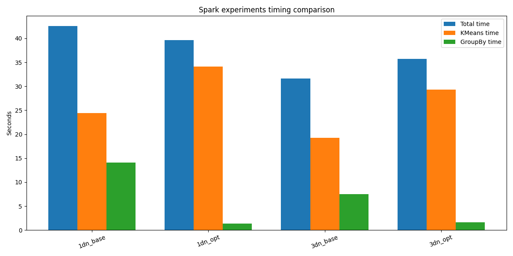

<h1 align="center">
Spark Lab 2
</h1>

## Сравнение времени

## Запуск

1. Распаковать датасет в папке `data`
2. Создать сеть `docker network create cluster1`
3. Создать сеть `docker network create cluster3`
4. Замер с 1 нодой `docker compose -f .\docker-compose-1-node.yaml up --build`
5. Замер с 3 нодами `docker compose -f .\docker-compose-3-nodes.yaml up --build`
